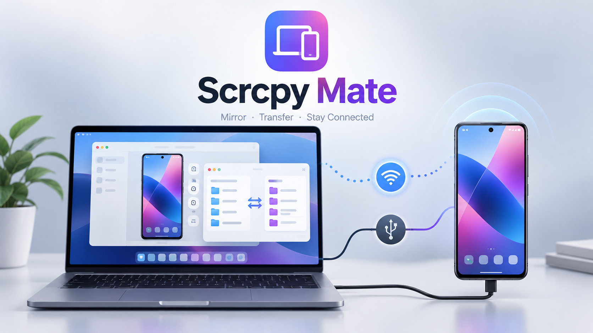

# Scrcpy Mate

Scrcpy Mate is a native macOS companion for Android, powered by [scrcpy](https://github.com/Genymobile/scrcpy) and ADB. It brings screen mirroring, wireless debugging, audio and input controls, Samsung DeX, and file transfer into one compact app.

## Download

Download the latest ready-to-use package from **[GitHub Releases](https://github.com/AnthonyTsun/Scrcpy-Mate/releases/latest)**.

The portable package includes scrcpy, ADB, and the required runtime libraries. Homebrew is not required.

## Install

1. Download and unzip `Scrcpy Mate Portable.zip`.
2. Drag **Scrcpy Mate** to the Applications folder.
3. If macOS displays a security warning on first launch, right-click the app and choose **Open**.
4. On the Android phone, enable **Developer options** and **USB debugging**.

> The downloadable build is ad-hoc signed, not Apple-notarized. macOS may therefore ask for confirmation when the app is opened for the first time.

## Quick start

### USB

1. Connect the phone with a data-capable USB cable.
2. Accept the USB debugging authorization prompt on the phone.
3. Select the device in Scrcpy Mate.
4. Click **Start Mirror**.

### Wi-Fi

1. Connect the Mac and phone to the same network.
2. Establish a USB connection once. Scrcpy Mate can then prepare and validate Wi-Fi mirroring automatically.
3. Android 11 or later can also pair through **Wireless debugging** using a QR code or pairing code.
4. After validation succeeds, click **Wireless Mirror**.

Wireless-debugging pairing and the later ADB connection may use different dynamic ports. Pair or reconnect after the phone changes networks.

## Features

- USB and Wi-Fi screen mirroring
- Android wireless-debugging QR and pairing-code support
- Phone audio, microphone, keyboard, and mouse controls
- Samsung DeX virtual desktop with adjustable display density
- Embedded two-pane Mac/Android file manager
- Drag-and-drop files, folders, and APKs
- Clipboard text synchronization and image transfer
- Chinese and English application interface
- System, light, and dark appearance modes
- Menu-bar mode with global shortcuts
- Portable package with bundled runtime dependencies

## Shortcuts

| Shortcut | Action |
| --- | --- |
| `Command-Shift-M` | Show or hide the Scrcpy Mate control panel |
| `Control-Option-Space` | Switch the macOS input language |
| `Control-Option-Command-Escape` | Emergency stop and release keyboard and mouse input |

The mirror window also supports standard scrcpy shortcuts, including `Command-H` for Home, `Command-B` for Back, and `Command-F` for full screen.

## Privacy

Scrcpy Mate runs locally. Device addresses and pairing information are used only to connect to the selected Android device. The app contains no analytics and does not upload personal files to third-party services.

Public release packages are checked to exclude local paths, device addresses, device serial numbers, pairing credentials, access tokens, private keys, and developer account details.

## Build from source

Requirements:

- macOS 13 or later
- Xcode Command Line Tools
- scrcpy
- Android SDK Platform-Tools

The current AppKit implementation is in `work/ScrcpyMate.m`. The script `work/bundle_portable_deps.sh` prepares the portable application bundle. Generated applications, downloaded tools, caches, and local device data are intentionally excluded from this repository.

## Acknowledgements

- [scrcpy](https://github.com/Genymobile/scrcpy) by Genymobile provides the core Android display and control technology.
- [OpenMTP](https://github.com/ganeshrvel/openmtp) by Ganesh Rathinavel inspired the dual-pane file-management architecture and interaction model. Scrcpy Mate uses its own ADB-backed transfer implementation, allowing file management over USB and Wi-Fi without exclusively occupying the phone's MTP interface.
- Android Debug Bridge is part of Android SDK Platform-Tools.

Third-party copyright and licence notices are included in [`work/OPEN_SOURCE_NOTICES.txt`](work/OPEN_SOURCE_NOTICES.txt).

## Licence

Scrcpy Mate source code is available under the [MIT License](LICENSE). Bundled third-party components remain under their respective licences.
